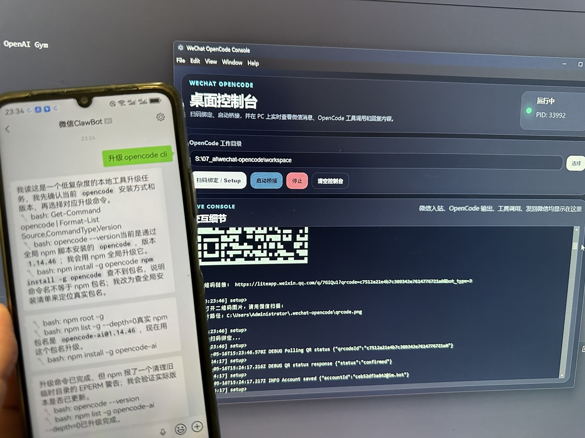
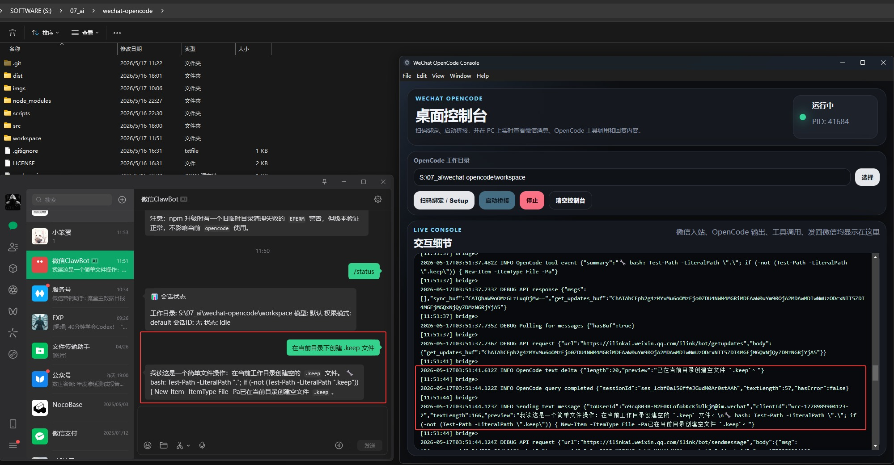

# wechat-opencode

将个人微信桥接到本地 OpenCode。微信消息会被转发给 `opencode run --format json`，并在你配置的工作目录中执行。




## 功能

- 通过微信与 OpenCode 文字对话
- 图片消息通过 OpenCode `--file` 附加
- 推送 OpenCode JSON 事件中的文本和工具调用进度
- 处理中发送新消息可中断当前任务
- 支持 `/help`、`/clear`、`/model`、`/cwd`、`/prompt`、`/status`、`/skills` 等命令
- 扫描 OpenCode skills：`~/.config/opencode/skills`、`~/.config/opencode/skill`、项目 `.opencode/skills`、`~/.claude/skills`、`~/.agents/skills`
- Node.js 跨平台 daemon 管理器

## 前置条件

- Node.js >= 18
- 已安装并登录 OpenCode CLI
- 可扫码绑定的个人微信账号

## 安装

```bash
git clone https://github.com/Wechat-ggGitHub/wechat-opencode.git ~/.config/opencode/skills/wechat-opencode
cd ~/.config/opencode/skills/wechat-opencode
npm install
```

## 快速开始

```bash
npm run setup
npm run daemon -- start
```

然后直接在微信中发消息。

## Linux 后台模式

适合 Linux 服务器、SSH 环境、无 GUI 机器，或者希望桥接服务在后台持续运行的场景。

一键安装并启动：

```bash
chmod +x start.sh
./start.sh
```

首次绑定会在终端打印黑白字符二维码。如果 Linux 没有图形界面，直接用微信扫描终端里的二维码：

```bash
npm run setup
```

启动后台桥接：

```bash
npm run daemon -- start
```

查看状态：

```bash
npm run daemon -- status
```

查看日志：

```bash
npm run daemon -- logs
```

停止桥接：

```bash
npm run daemon -- stop
```

代码或配置变更后重启：

```bash
npm run daemon -- restart
```

当前 `daemon` 使用 Node 跨平台管理器；但 Linux/headless 场景推荐使用这个后台模式。数据和日志存储在 `~/.wechat-opencode/`。

## 桌面控制台

适合 Windows 或有 GUI 的机器，提供按钮和实时交互控制台。

Windows 可直接双击 `start.vbs`。它会隐藏黑框启动桌面应用，并把启动日志写入 `~/.wechat-opencode/logs/windows-startup.log`。

如果需要排错，再直接运行批处理查看终端输出：

```powershell
start-windows.cmd
```

启动 Electron 控制台：

```bash
npm run desktop
```

控制台支持：

- 选择 OpenCode 工作目录
- 扫码绑定微信账号
- 按钮启动/停止桥接
- 实时显示微信入站消息、OpenCode 文本输出、工具调用和发回微信的内容

Electron 模式下，桥接进程是桌面应用的子进程。使用窗口里的启动/停止按钮控制；关闭窗口会停止由该窗口启动的桥接进程。

## 服务命令

```bash
npm run daemon -- status
npm run daemon -- stop
npm run daemon -- restart
npm run daemon -- logs
```

## 微信命令

| 命令 | 说明 |
| --- | --- |
| `/help` | 显示帮助 |
| `/clear` | 清除当前会话 |
| `/reset` | 完全重置，包括工作目录 |
| `/model <provider/model>` | 切换 OpenCode 模型 |
| `/permission <mode>` | 切换权限模式 |
| `/prompt [text]` | 查看或设置每次运行前置的系统提示词 |
| `/status` | 查看会话状态 |
| `/cwd [path]` | 查看或切换工作目录 |
| `/skills` | 列出已安装的 OpenCode skills |
| `/history [n]` | 查看最近聊天记录 |
| `/compact` | 开始新的 OpenCode session |
| `/undo [n]` | 删除最近的本地聊天记录 |
| `/<skill> [args]` | 让 OpenCode 使用某个已安装 skill |

## 权限模式

- `default`：使用 OpenCode 当前配置的权限规则
- `plan`：使用 `--agent plan`
- `auto`：使用 `--dangerously-skip-permissions`
- `acceptEdits`：保留命令兼容性，目前映射为 OpenCode 默认行为

## 工作方式

```text
微信（手机） <-> ilink bot API <-> Node.js daemon <-> opencode run --format json
```

数据存储在 `~/.wechat-opencode/`。
